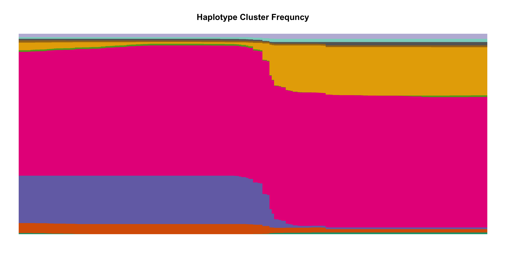

#+title: Imputation and Admixture for lcWGS in one goal
[[https://github.com/Zilong-Li/phaseless/actions/workflows/linux.yml/badge.svg]]
[[https://github.com/Zilong-Li/phaseless/actions/workflows/mac.yml/badge.svg]]

Phaseless is designed for genotype imputation and admixture inference using low coverage sequencing data.
Firstly, the imputation model is in the spirit of [[https://www.ncbi.nlm.nih.gov/pmc/articles/PMC1424677/][fastPHASE]] model but with genotype likelihood as input, and likewise [[https://www.nature.com/articles/ng.3594][STITCH]] works on raw reads. Next, the admixture inference is modeled on the haplotype cluster information from the fastphase model.

* Table of Content :TOC:Quote:
#+BEGIN_QUOTE
- [[#build][Build]]
- [[#usage][Usage]]
  - [[#imputation][Imputation]]
  - [[#admixture][Admixture]]
  - [[#parameters][Parameters]]
  - [[#plotting][Plotting]]
- [[#output][Output]]
- [[#changes][Changes]]
#+END_QUOTE

* Build

#+begin_src shell
git clone https://github.com/Zilong-Li/phaseless
make -j6
#+end_src

* Usage

=phaseless= owns subcommands. please use =phaseless -h= to check it out.

** Imputation
The parallelism of =phaseless impute= is designed for impute the whole genome at once, which means it run multiple chunks in parallel with each taken over by a thread. Check out the =--chunksize= option.

** CUDA acceleration for the joint model

The joint model has an optional NVIDIA CUDA E-step. Build it with a CUDA toolkit and a GPU with compute capability 6.0 or newer:

#+begin_src bash
make clean
make CUDA=1                 # override CUDA_ARCH=60 when needed
./phaseless joint -g data/bgl.gz -c 10 -k 3 --gpu -o joint
#+end_src

The CPU and CUDA joint-model backends exploit exchangeability of the two unphased chromosome copies by storing only the =C(C+1)/2= unordered cluster pairs; diagonal states have multiplicity one and off-diagonal states multiplicity two in full diploid sums. The CUDA implementation batches individuals according to available device memory. Genotype likelihoods and device allocations persist across EM iterations; emissions and ancestry-weighted cluster frequencies are cached once per batch; sufficient statistics use a two-stage reduction without global atomics. The regular build and command remain CPU-only; requesting =--gpu= from a CPU-only binary reports an actionable error instead of silently falling back.

** STITCH-inspired joint-model heuristics

The joint model can opt into the label-alignment and unused-cluster revival ideas described in [[https://media.springernature.com/original/springer-static/esm/art%3A10.1038%2Fng.3594/MediaObjects/41588_2016_BFng3594_MOESM53_ESM.pdf][STITCH Supplementary Information, Section 1.6]]:

#+begin_src shell
./phaseless joint -g data/bgl.gz -c 10 -k 3 --stitch-heuristics -o joint
#+end_src

The heuristics run only inside the adaptive shared-haplotype initialization controlled by =--init-haplotype-iterations=. Cluster labels are aligned every fourth initialization scan after the first four scans. On the alternating schedule, posterior chromosome-copy occupancy is averaged over 100-SNP blocks and continuous intervals below 1% usage are initialized from a usage-weighted donor cluster with 80% donor emissions and 20% uniform noise. The heuristic phase closes when the likelihood and normalized posterior cluster-usage profile first stabilize, or early enough to reserve the final eight scans. Initialization can finish only after an eight-scan heuristic-free cooldown, and its final E-step generates the cluster-usage profile used for ancestry initialization.

The heuristic details can be changed with =--heuristic-block-size=, =--heuristic-reset-radius=, =--heuristic-min-usage=, and =--heuristic-donor-weight=; their total scan budget comes exclusively from =--init-haplotype-iterations=. No label alignment, cluster revival, or parameter reset is performed again during full joint optimization. SqS3 therefore starts directly from the selected posterior-driven candidate, while =--no-accel= uses ordinary EM from that same candidate. The random choices use =--seed=.

** Posterior-driven joint-model initialization

The joint model now uses a structured start by default. First it makes =Q= uniform and =F= identical across ancestries and fits a shared-haplotype HMM. Genome-wide posterior cluster-occupancy profiles are then normalized per individual and grouped with multi-start farthest-point/k-means initialization. Distances to the group centroids define soft =Q= values, and each group's weighted cluster profile tilts a copy of the shared =F=. Short fixed-haplotype ancestry refinements select the candidate with the highest observed likelihood.

After candidate selection, joint optimization starts directly from the highest observed-likelihood candidate; there is no staged continuation or alternating block warm-up. The initialization scans are additional to =--iterations=.

The shared-haplotype stage now runs for at least 12 and at most 50 scans. It stops early only after three consecutive scans have both relative likelihood change below =1e-4= and normalized posterior-profile RMS change below =2e-3=. A final E-step produces profiles corresponding exactly to the saved shared parameters. When =--stitch-heuristics= is enabled, initialization reserves at least eight scans after its last possible heuristic perturbation before it can stop. The remaining defaults are 15 ancestry-refinement scans, three starts, and noise 0.05. These settings can be changed with the =--init-haplotype-*= options, =--init-ancestry-iterations=, =--init-restarts=, and =--init-noise=. Use =--random-init= to bypass the structured start for regression comparisons. An explicit =--qfile= also bypasses it so the supplied start is not overwritten. Posterior-driven initialization evaluates its shared-haplotype scans on the CPU so it can retain per-individual profiles; a requested CUDA backend resumes afterward.

Each ancestry receives a symmetric pseudocount of 0.5 during a =Q= update. This weak regularization prevents an ancestry proportion with low expected occupancy from being driven immediately to the numerical boundary. Set =--q-pseudocount 0= to recover the unregularized update.

Each =P= update also receives 0.5 effective chromosome copies of prior weight centered on the pooled allele frequency at that site. Unlike a symmetric Beta prior centered on 0.5, this stabilizes low-occupancy cluster/site cells without pulling genuinely rare and common sites toward the middle. Change the strength with =--p-shrinkage= or set =--p-shrinkage 0= to recover the unregularized update.

The joint convergence defaults are an observed likelihood improvement per observation of =1e-5=, relative likelihood change of =2e-6=, parameter change of =5e-4=, and three consecutive stable iterations. Aitken rate and estimated gap are logged as diagnostics but do not control stopping because the extrapolation is discontinuous when the estimated rate crosses one.

SqS3 acceleration compares the fully evaluated extrapolated state with the fully evaluated result of two ordinary EM maps. All of =Q,P,F,r= are snapshotted and restored together, a non-finite proposal falls back to ordinary EM, and the best observed-likelihood state is retained across every optimization mode.

The SqS3 step length balances mean-square changes in =Q= and =F= so the much larger =F= array does not dominate the extrapolation. The optimizer switches to ordinary EM near convergence, when at least 20% of the last 24 proposals were rejected, when the last 16 proposals delivered less than 5% mean realized improvement over ordinary EM, or for the final reserved part of the iteration budget. The history-based conditions are activated only after the accelerated likelihood is already within a tolerance-scaled neighborhood. Only the non-accelerated finishing sequence is used for the consecutive likelihood-improvement and parameter-stability stopping test.

On the CPU backend, per-individual sufficient statistics are merged in sample order rather than thread-completion order. Consequently, repeated runs with the same input, options, and =--seed= make the same threshold, donor, and noise decisions during cluster revival, independently of the CPU thread count.

#+begin_src shell
phaseless impute -g data/bgl.gz -c 10 -n 4 -s 100000
#+end_src

However, one might only be interested in imputing a single chunk for whatever reason. To change the behavior of parallelism and make it running in parallel for single chunk, we can use =--single-chunk= option to toggle the behavior.

#+begin_src shell
phaseless impute -g data/bgl.gz -c 10 -n 4 -S
#+end_src

** Admixture
With the binary file outputted by the above =impute= command, we can run admixture inference for different =k= ancestry.
#+begin_src shell
phaseless admix -b impute.pars.bin -k 3 -n 4
#+end_src
** Parameters
Besides, we can investigate and manipulate the parameters from =fastPHASE= model using the binary file outputted by =impute= command.
#+begin_src shell
phaseless parse -b impute.pars.bin -c 0 ## single chunk, all samples
phaseless parse -b impute.pars.bin -c -1 -s samples.txt ## all chunks, specifc samples
#+end_src

** Plotting
Now, we can do some interesting plotting.
#+begin_src shell
./misc/plot_haplotype_cluster.R
#+end_src

* Output

Without specifying the output prefix =-o=, the output filenames of the above commands are as follows:

#+begin_src shell
❯ tree -L 1
.
├── admix.Q
├── admix.log
├── parse.haplike.bin
├── parse.log
├── impute.recomb
├── impute.pi
├── impute.vcf.gz
├── impute.pars.bin
└── impute.log
#+end_src

* Changes
check out the [[file:news.org][news]] file.
